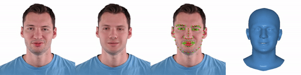

<h2 align="center"><b>Metrical Photometric Tracker</b></h2>

<h4 align="center"><b><a href="https://zielon.github.io/" target="_blank">Wojciech
Zielonka</a>, <a href="https://sites.google.com/site/bolkartt/" target="_blank">Timo
Bolkart</a>, <a href="https://justusthies.github.io/" target="_blank">Justus Thies</a></b></h4>

<h6 align="center"><i>Max Planck Institute for Intelligent Systems, Tübingen, Germany</i></h6>

<h4 align="center">
<a href="https://youtu.be/vzzEbvv08VA" target="_blank">Video&nbsp</a>
<a href="https://arxiv.org/pdf/2204.06607.pdf" target="_blank">Paper&nbsp</a>
<a href="https://zielon.github.io/mica/" target="_blank">Project Website&nbsp</a>
<a href="mailto:&#109;&#105;&#099;&#097;&#064;&#116;&#117;&#101;&#046;&#109;&#112;&#103;&#046;&#100;&#101;">Email</a>
</h4>

<div align="center"> 

<br>
<b style="font-size: 1.05em;">From the left: RGB Input, Estimated Texture, Predicted Landmarks (red), FLAME Geometry.</b>
<br>
<i style="font-size: 1.05em;">Official Repository for ECCV 2022 Metrical Photometric Tracker (from MICA).</i>
</div>

### Description

Metrical **monocular** tracker based on sequential color optimization. It returns optimized FLAME mesh, statistical
texture coefficients, and pinhole camera intrinsic and extrinsic parameters. For each frame, a checkpoint will be
created
that stores all the information. Additionally, depth maps and meshes are also saved.

### Installation

After cloning the repository please install the environment by running the `install.sh` script. It will prepare the
tracker for usage. Please note to obtain [BFM texture](https://faces.dmi.unibas.ch/bfm/bfm2017.html), **which was
used in our results and projects**, you have to follow the [BFM_to_FLAME](https://github.com/TimoBolkart/BFM_to_FLAME)
repository. By
default, the FLAME texture will be downloaded and used in the output folder.

Before installation, you need to create an account on the [FLAME website](https://flame.is.tue.mpg.de/) and prepare your
login and password beforehand. You will be asked to provide them in the installation script.

```shell
git clone https://github.com/Zielon/metrical-tracker.git
cd metrical-tracker
./install.sh
```

### Usage

Our tracker needs [MICA](https://github.com/Zielon/MICA) predictions to run. The `identity.npy` file you can find in the
output folder of the [demo.py](https://github.com/Zielon/MICA/blob/master/demo.py) file. Once the shape/identity file is
generated you can simply select the corresponding video and run the tracker. Look at the three
sequences `{duda, justin, wojtek}` from the example dataset
in the `input` folder. Please, follow the same naming convention for your custom datasets. In the configuration file,
you can specify the input and output folders.

```shell
python tracker.py --cfg ./configs/actors/duda.yml
```

#### Tips

- in the case of fast-changing sequences you might adjust the learning rate for **R** and **T** in the config.
- MediaPipe sometimes detects wrong landmarks for the first frame in the sequence. You might skip this frame in optimization.
- there are many hyper-parameters involved in the optimization, please look at the `config.py` and tweak them to further improve
  your results.
- the **keyframes** are the frames for which global color and shape will be optimized, therefore select frames with neutral pose preferably.

### Projects

This tracker has been used in the following projects:

- [INSTA - Instant Volumetric Head Avatars (CVPR2023)](https://zielon.github.io/insta/)
- [SHOW - Synchronous HOlistic body in the Wild (CVPR2023)](https://github.com/yhw-yhw/SHOW)
- [MICA - Towards Metrical Reconstruction of Human Faces (ECCV2022)](https://zielon.github.io/mica/)
- [IMITATOR - Personalized Speech-driven 3D Facial Animation (ICCV2023)](https://balamuruganthambiraja.github.io/Imitator/)

### Citation

If you use this project in your research please cite MICA:

```bibtex
@proceedings{MICA:ECCV2022,
  author = {Zielonka, Wojciech and Bolkart, Timo and Thies, Justus},
  title = {Towards Metrical Reconstruction of Human Faces},
  journal = {European Conference on Computer Vision},
  year = {2022}
}
```
